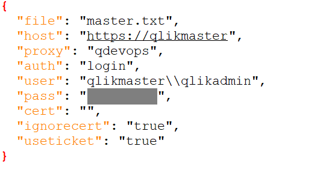

# FAQ

## 1. Can't connect to server
qdevops uses Qlik .NetSDK to connect to Qlik Sense Server. The Qlik Sense Virtual Proxy Configuration might influence in this connection.
Follow theses steps to make sure you can connect:
* Use the following command to connect:
  * -i sets interactive mode, all the parameters will be asked.
  * -a adds a server configuration to '.\server\' folder

```
qdevops -i -a
```

* Check the Virtual Proxy. It's recommended that you create a new one, so you can manage the connection separately.
  * Make sure *Authentication method* is 'Ticket'
  * Make sure *Windows Authentication pattern* is 'Windows'


* Check qdevops server configuration, located by default at '\<qdevops dir>\servers'
  * Make sure the *host* does not ends with '/'
  * The proxy (virtual) is correct
  * *user* is in the format 'DOMAIN\USER'. It's showing '\\\\' because is a json file.
  * *useticket* is set to 'false'. This feature will be implemented.


* If everything is ok, the following command should show the apps from your server:
```
qdevops -u=<your-server-file.txt> -l
```
