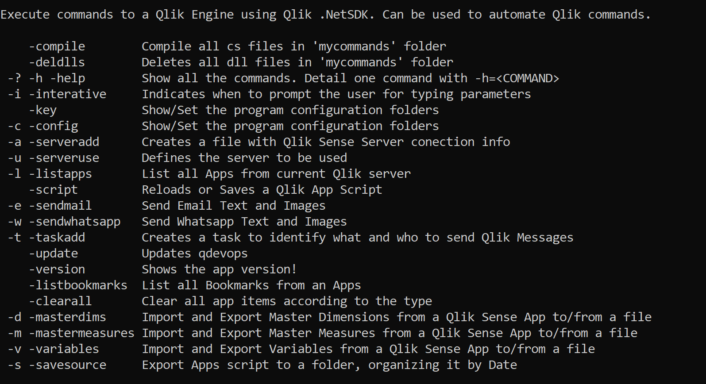

qdevops
App to easily automate Qlik Sense operations. 
Import and Export variables between apps, master dimensions, measures and more.

By the way, you can create your own functions.

## Default Commands list

## Sample commands
#### List apps from Qlik Sense Desktop
```
qdevops -u=desktop -l
```
#### Add a Qlik Sense Server reference file
This command will ask individually for each parameter need to connect to Qlik Sense. These parameters will be saved on JSON format, under '.\servers' folder.
```
qdevops -i -a
```
This command create a master.txt file with connection information that can be used later
```
qdevops -a=master.txt,MyDomain\MyUser,MyPass,https://myserver.domain.com/
```


#### Export variables from a server
```
qdevops -u=master.txt -v=export,dbc91f77-ec37-4b01-9fe8-9241423aaac8,vars.txt
```

## Creating your own functions
Create your file like the the example and put it at 'mycommands' folder, than use 
```
qdevops -compile
```
C# Example 

```csharp
using System;
using System.IO;
using qdevopsbase.server;
using Qlik.Engine;
using System.Collections.Generic;

public class mylist : iqlikcommand
{
	public string CommandId => "w|mylist";
	public string HelpTip => "TEST - List all Apps from current Qlik server";
	public void Execute((JObject args, ref ILocation loc, qlikcommandconfig conf))
	{
		IEnumerable<IAppIdentifier> apps_info = loc.GetAppIdentifiers();
		foreach (var item in apps_info)
		{
			Console.WriteLine($"TEST - {item.AppId}");
		}
	}}
```